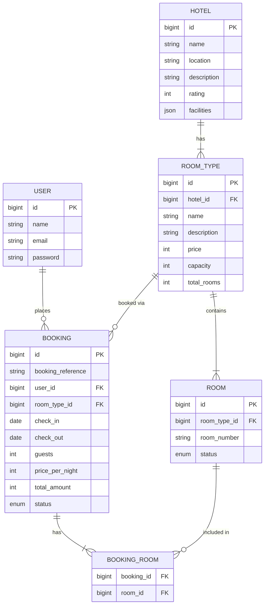

# Hotel Booking System API

A Laravel-based Hotel Booking REST API featuring automatic room generation, real-time date-based availability checking, and dynamic booking assignments without race conditions.

---

## 🚀 Setup Steps

Follow these steps to get the project running locally.

1. **Clone the repository** (if not already downloaded):
   ```bash
   git clone <repository-url>
   cd hotel-booking-system
   ```

2. **Install Composer dependencies:**
   ```bash
   composer install
   ```

3. **Configure Environment:**
   ```bash
   cp .env.example .env
   ```
   Open the `.env` file and set up your database connection details (e.g., `DB_DATABASE=hotel_booking`, `DB_USERNAME=root`).

4. **Generate Application Key:**
   ```bash
   php artisan key:generate
   ```

5. **Run Migrations (Database Setup):**
   ```bash
   php artisan migrate
   ```

6. **Start the local server:**
   ```bash
   php artisan serve
   ```
   The API will be available at `http://127.0.0.1:8000/api/v1`.

---

## 🗄️ Database Design

Below is the Entity-Relationship (ER) Diagram mapping out the relational data structure.



---

## 🌐 API Documentation

### 1. Authentication
*Requires no authentication.*

| Method | Endpoint | Description | Payload Example |
|---|---|---|---|
| `POST` | `/api/v1/register` | Register a new user | `{"name":"John", "email":"j@example.com", "password":"password", "password_confirmation":"password"}` |
| `POST` | `/api/v1/login` | Login and receive a Bearer token | `{"email":"j@example.com", "password":"password"}` |

### 2. Available Hotels & Search
*Publicly accessible endpoints.*

| Method | Endpoint | Description |
|---|---|---|
| `GET` | `/api/v1/hotel` | List all hotels. |
| `GET` | `/api/v1/hotel/{id}` | Get specific hotel details. |
| `GET` | `/api/v1/availability/hotels` | Advanced search for hotels and available room counts. |

**Search Payload for `/availability/hotels` (Query Parameters):**
```text
?location=NYC
&name=Grand
&check_in=2026-10-10
&check_out=2026-10-15
&min_price=100
&max_price=1000
&min_rating=4
```

### 3. Bookings
*Requires `Authorization: Bearer <token>` header.*

| Method | Endpoint | Description |
|---|---|---|
| `GET` | `/api/v1/bookings` | List all bookings belonging to the authenticated user. |
| `POST` | `/api/v1/bookings` | Check availability, create a booking, and auto-assign rooms. |
| `PATCH` | `/api/v1/bookings/{id}/cancel` | Cancel an active booking and free up the physical rooms. |

**Create Booking Payload:**
```json
{
  "room_type_id": 1,
  "check_in": "2026-10-10",
  "check_out": "2026-10-15",
  "guests": 2,
  "rooms_count": 1
}
```

### 4. Admin / Hotel Management
*Admin routes.*

| Method | Endpoint | Description | Payload Example |
|---|---|---|---|
| `POST` | `/api/v1/hotel` | Create hotel, room types, and auto-generate rooms | *(See below)* |
| `PATCH` | `/api/v1/hotel/{id}` | Update hotel details | `{"name": "New Name"}` |
| `DELETE` | `/api/v1/hotel/{id}` | Delete a hotel entirely | None |

**Create Hotel Payload:**
```json
{
    "name": "Grand Hotel",
    "location": "NYC",
    "description": "Luxury hotel",
    "rating": 5,
    "facilities": "[\"wifi\", \"pool\"]",
    "room_types": [
        {
            "name": "Deluxe",
            "description": "Deluxe Room",
            "price": 200,
            "capacity": 2,
            "total_rooms": 5
        }
    ]
}
```
